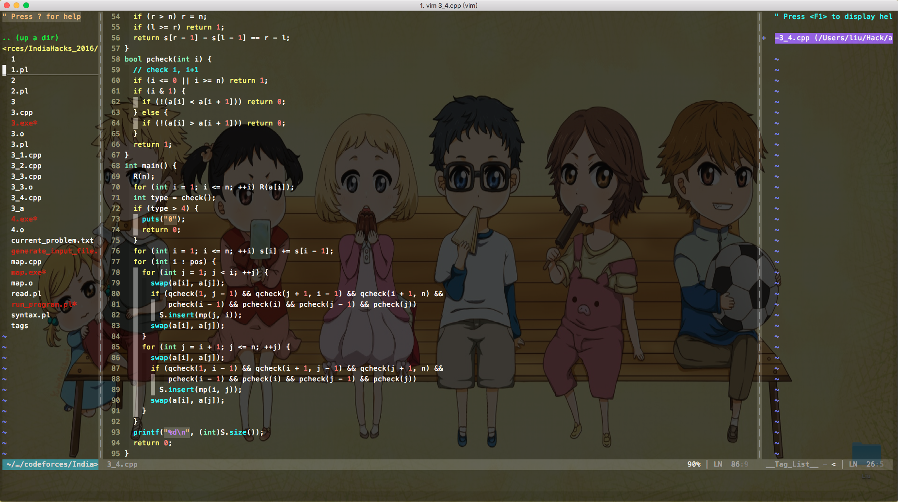

##Install

```bash
git clone https://github.com/liuxueyang/VimPlugin ~/.vim
mv ~/.vimrc ~/backup.vimrc
mv ~/.gvimrc ~/backup.gvimrc
cp ~/.vim/vimrc ~/.vimrc 
cp ~/.vim/gvimrc ~/.gvimrc 
```

---

The following picture is the my gvim:



### Update on 03/21/16

1. 配置taglist插件，实现程序内的方便跳转。
2. 修改部分快捷键的映射。
3. 增加自动格式化代码的插件，能够把格式混乱的C/C++程序按照比较优美的格式排版。

即使用Vim很久，然而还是能发现很多有意思的功能，这就是Vim的乐趣？ :joy::joy::joy:

### Update on 03/25/16

配置Powerline的字体参见`~/.vim/bundle/vim-powerline/fontpatcher/README.rst`即可。亲测Linux和Mac中的Vim和Gvim（MacVim）都可以。:joy::joy:

