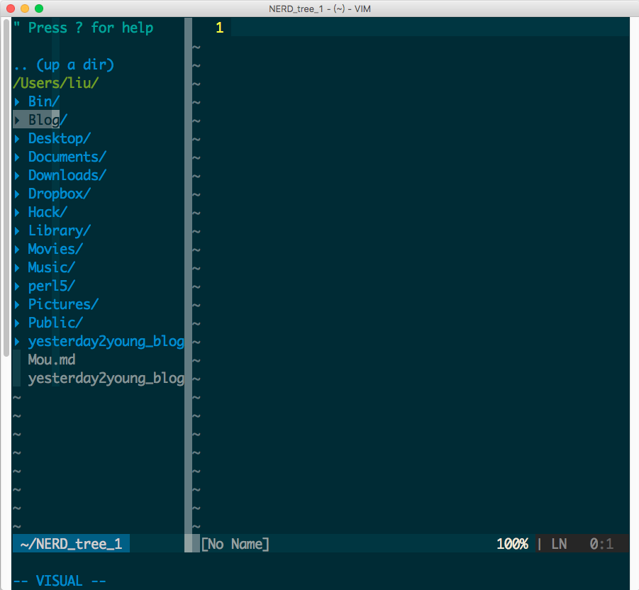

##Install

```bash
git clone https://github.com/liuxueyang/VimPlugin ~/.vim
mv ~/.vimrc ~/backup.vimrc
mv ~/.gvimrc ~/backup.gvimrc
cp ~/.vim/vimrc ~/.vimrc 
cp ~/.vim/gvimrc ~/.gvimrc 
```

---

The following picture is the my gvim:


