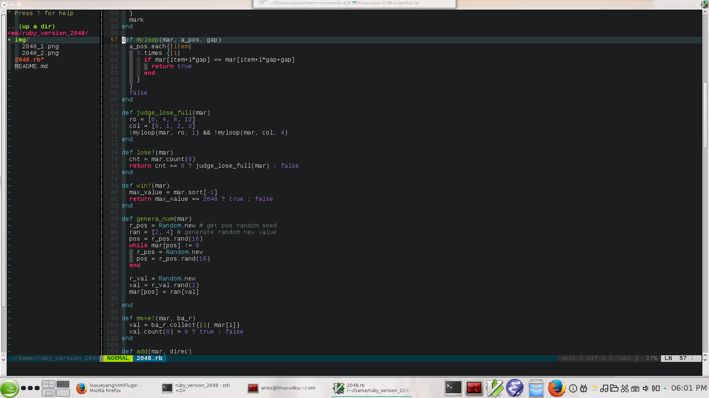

##Install

git clone https://github.com/liuxueyang/VimPlugin ~/.vim
cd ~/.vim 
cp vimrc ~/.vimrc 
cp gvimrc ~/.gvimrc 

---

There are three files: onepush, allpush, allpull
These three bash scripts are used to push my repositories by git.

The fllowing picture is the my gvim:

